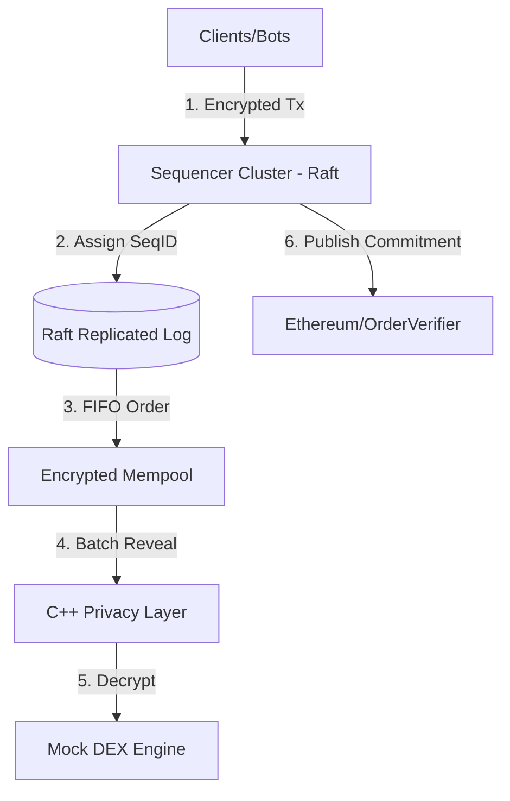

# Secure-Order: FIFO Sequencing Layer for MEV Mitigation

Secure-Order is a high-performance, modular sequencing layer designed to eliminate Miner Extractable Value (MEV) exploitation through **Encrypted Transaction Ordering**. By using a commit-reveal scheme, the system ensures that transactions are sequenced in a verifiable FIFO (First-In-First-Out) order before their contents are visible to any actor, including the sequencer.

## 🌟 Key Features

- 🔐 **Privacy-First (C++)**: Leverages `libsodium` for high-speed `curve25519-xsalsa20-poly1305` encryption.
- ⏱️ **Verifiable FIFO**: Assigns immutable sequence IDs upon receipt, guaranteed by Raft consensus.
- 🛡️ **MEV Prevention**: Front-running and sandwich attacks are mathematically impossible as transaction data is encrypted during sequencing.
- 🔗 **Blockchain Commitment**: Cryptographic proofs of order are published to an Ethereum-compatible smart contract (`OrderVerifier`).
- 🚀 **Scalable Consensus**: Distributed sequencer cluster powered by the Raft consensus algorithm.

## 🏗️ Architecture



## 🛠️ Technology Stack

- **Privacy Layer**: C++17, libsodium
- **Sequencing Engine**: Go 1.21+
- **Consensus**: Hashicorp Raft
- **Smart Contracts**: Solidity, Hardhat, Ethers.js
- **Communication**: gRPC (Protobuf)

---

## 🚀 Quick Start

### 1. Prerequisites

**macOS:**
```bash
brew install libsodium cmake pkg-config go node
```

**Ubuntu:**
```bash
sudo apt update && sudo apt install -y build-essential cmake libsodium-dev pkg-config golang-go nodejs npm
```

### 2. Build the System

```bash
# Build C++ Privacy Layer
cd cpp && mkdir -p build && cd build
cmake .. && make -j$(nproc)
cd ../..

# Install JS dependencies (for Smart Contracts)
npm install

# Build Go Binaries
./scripts/build-local.sh
```

### 3. Run a 5-Node Raft Cluster (Demo)

```bash
# Start 5 sequencers
./scripts/run-5-node-raft.sh --fresh

# Find the current leader's port
./scripts/find-leader.sh

# Run a load test against the leader (e.g., port 12345)
ADDR=localhost:12345 ./scripts/load-local-raft.sh
```

---

## 📜 Smart Contract Integration

The sequencer generates a cryptographic commitment for every batch of transactions. This commitment is published to the `OrderVerifier` contract on-chain to provide a proof-of-sequencing.

### Deploying the Contract
```bash
# Start a local EVM node
./scripts/run-local-evm.sh

# Deploy OrderVerifier
./scripts/deploy-local-order-verifier.sh
```

### Running Sequencer with EVM
```bash
# This script automatically reads the deployed address and connects
./scripts/run-local-raft-with-evm.sh --fresh
```

---

## 📂 Project Structure

- `cmd/`: Entry points for `sequencer`, `client`, and `loadtest`.
- `pkg/`: Core logic for `privacy` (C++ wrapper) and `sequencing` (Raft/Queue).
- `cpp/`: C++ implementation of the encryption/decryption engine.
- `contracts/`: Solidity smart contracts for order verification.
- `internal/rpc/`: gRPC server implementation.
- `scripts/`: Automation scripts for deployment and testing.
- `proto/`: Protocol Buffer definitions.

## 🤝 Team
- Devarsh Doshi, Dhairya Rupani, Drumil Bhati, Prasham Mehta, Vidhan Nahar

## 📝 License
MIT License
