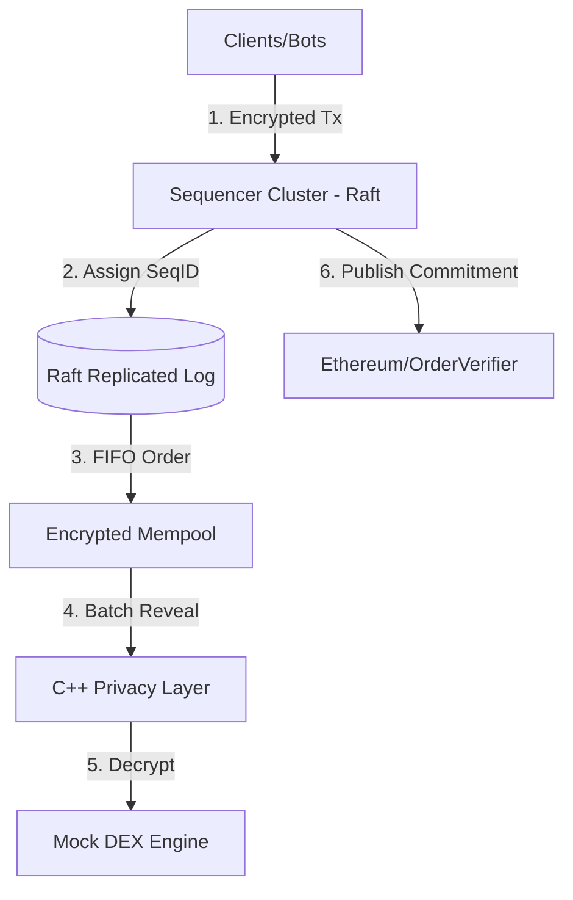
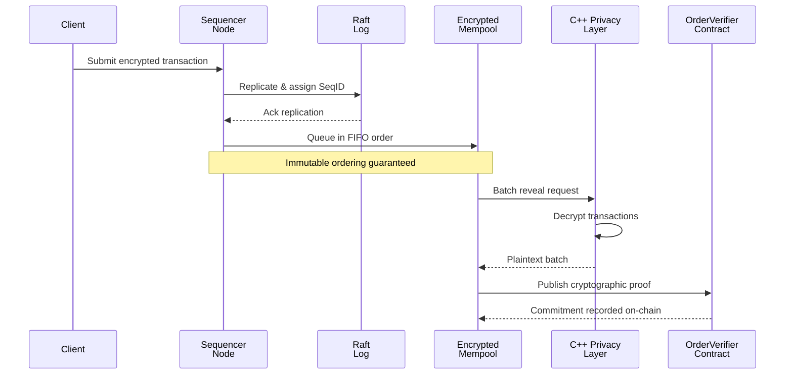
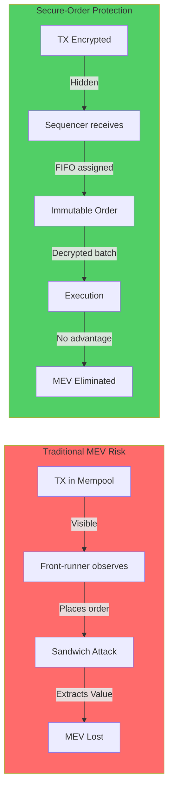
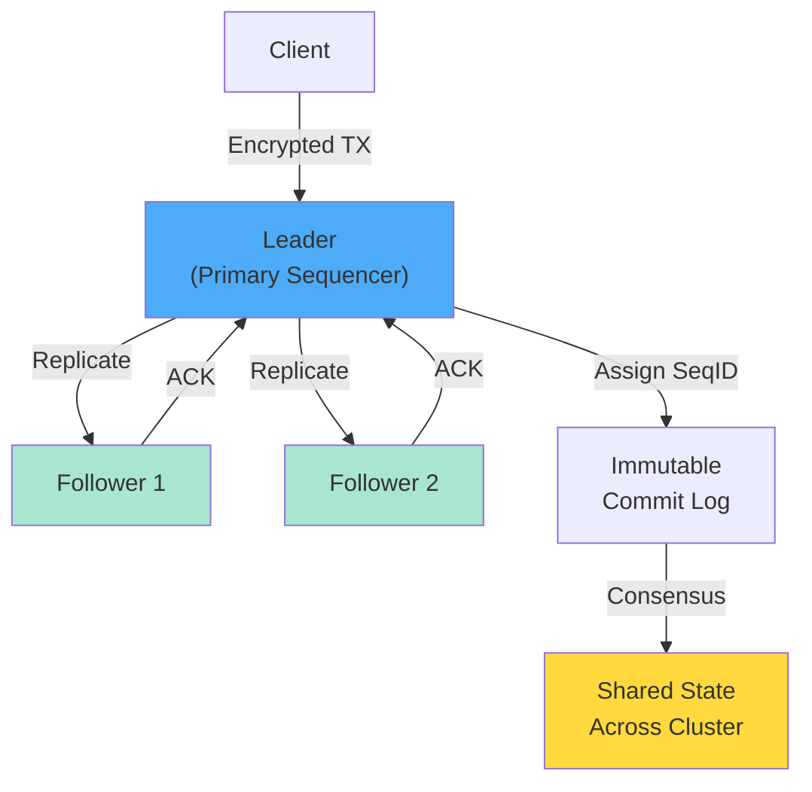
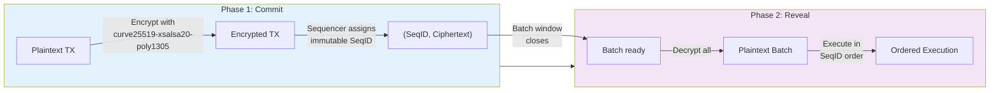
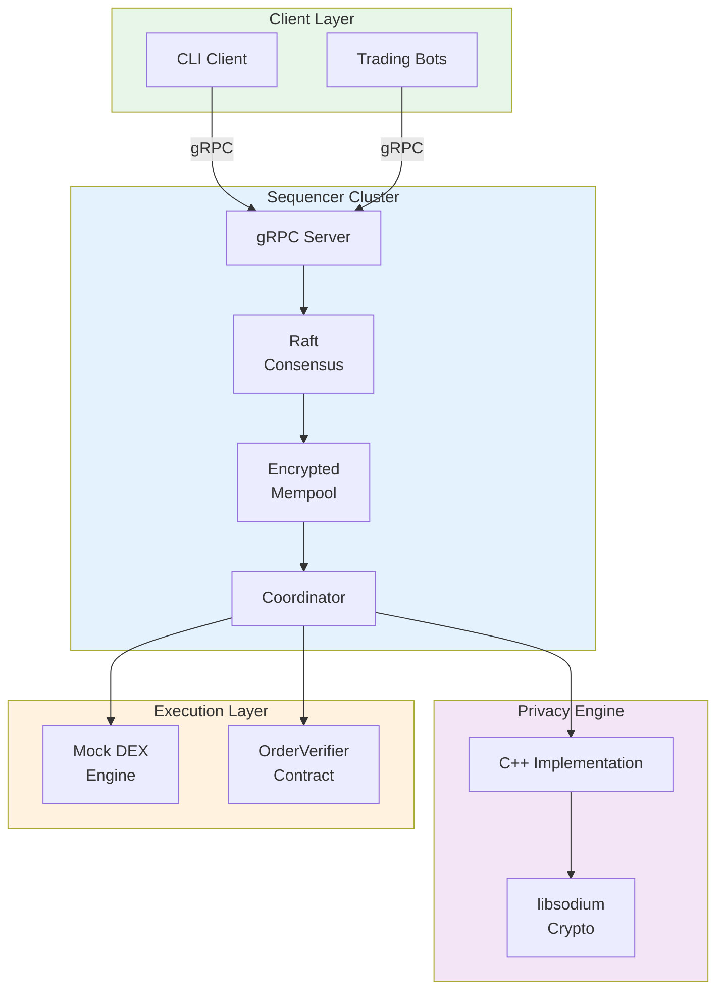
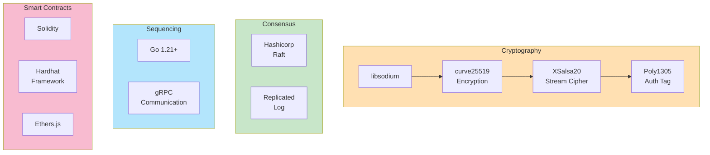
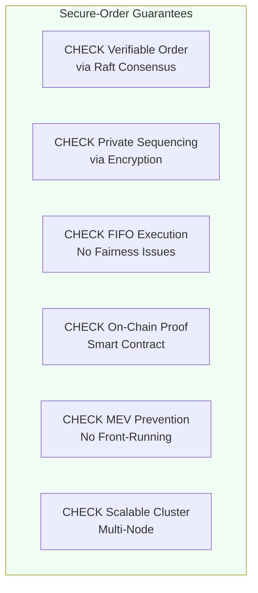
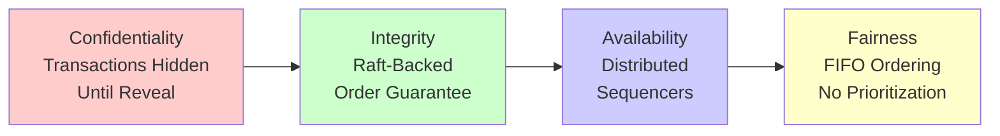

# Secure-Order: FIFO Sequencing Layer for MEV Mitigation

Secure-Order is a high-performance, modular sequencing layer designed to eliminate Miner Extractable Value (MEV) exploitation through **Encrypted Transaction Ordering**. By using a commit-reveal scheme, the system ensures that transactions are sequenced in a verifiable FIFO (First-In-First-Out) order before their contents are visible to any actor, including the sequencer.

## 🌟 Key Features

- 🔐 **Privacy-First (C++)**: Leverages `libsodium` for high-speed `curve25519-xsalsa20-poly1305` encryption.
- ⏱️ **Verifiable FIFO**: Assigns immutable sequence IDs upon receipt, guaranteed by Raft consensus.
- 🛡️ **MEV Prevention**: Front-running and sandwich attacks are mathematically impossible as transaction data is encrypted during sequencing.
- 🔗 **Blockchain Commitment**: Cryptographic proofs of order are published to an Ethereum-compatible smart contract (`OrderVerifier`).
- 🚀 **Scalable Consensus**: Distributed sequencer cluster powered by the Raft consensus algorithm.

## 🏗️ Architecture

### System Overview


### Transaction Flow Pipeline


### MEV Protection Mechanism


### Raft Consensus for Ordering


### Privacy Layer: Commit-Reveal Scheme


### Component Architecture


### Technology Stack


## 📊 How It Works: Step-by-Step

### The Problem We Solve
```
Traditional DEX:
User TX in Mempool → Attacker sees TX → Front-runs it → User pays premium
                                           MEV extracted = User's loss
```

```
Secure-Order:
User TX encrypted → Sequencer assigns order → TX revealed → Executed in order
                       No one sees contents → No front-running possible
```

### Execution Flow Diagram

```mermaid
graph LR
    Step1["Step 1: Client encrypts<br/>transaction"] -->
    Step2["Step 2: Sends to<br/>sequencer"] -->
    Step3["Step 3: Raft consensus<br/>assigns SeqID"] -->
    Step4["Step 4: Stored in<br/>encrypted mempool"] -->
    Step5["Step 5: Batch revealed<br/>& decrypted"] -->
    Step6["Step 6: Execute in<br/>FIFO order"] -->
    Step7["Step 7: Proof published<br/>on-chain"]
    
    style Step1 fill:#e0e7ff
    style Step2 fill:#e0e7ff
    style Step3 fill:#ddd6fe
    style Step4 fill:#dbeafe
    style Step5 fill:#fbcfe8
    style Step6 fill:#fecbcb
    style Step7 fill:#fef08a
```


### Key Guarantees


---

## 🛠️ Technology Stack

- **Privacy Layer**: C++17, libsodium
- **Sequencing Engine**: Go 1.21+
- **Consensus**: Hashicorp Raft
- **Smart Contracts**: Solidity, Hardhat, Ethers.js
- **Communication**: gRPC (Protobuf)

### Security Properties


---


## 🚀 Quick Start

### 1. Prerequisites

**macOS:**
```bash
brew install libsodium cmake pkg-config go node
```

**Ubuntu:**
```bash
sudo apt update && sudo apt install -y build-essential cmake libsodium-dev pkg-config golang-go nodejs npm
```

### 2. Build the System

Build the native C++ library first, then build the Go binaries.

```bash
# Build C++ Privacy Layer
cd cpp
mkdir -p build
cd build
cmake -DCMAKE_INSTALL_PREFIX=. ..
make -j$(nproc)
make install
cd ../..

# Install JS dependencies (for Smart Contracts)
npm install

# Export linker/runtime environment
export CXXFLAGS="-std=c++17"
export LDFLAGS="-L./cpp/build/lib -lprivacy -lsodium -lstdc++"
export LD_LIBRARY_PATH="$PWD/cpp/build/lib:$LD_LIBRARY_PATH"

# Build Go binaries
./scripts/build-local.sh
```

If you want the sequencer to publish commitments to the EVM, build the sequencer with EVM support enabled:

```bash
CGO_ENABLED=1 go build -tags evm -o bin/sequencer ./cmd/sequencer
CGO_ENABLED=1 go build -o bin/client ./cmd/client
CGO_ENABLED=1 go build -o bin/rpc-loadtest ./cmd/rpc-loadtest
```

### 3. Kubernetes Deployment (Autoscaling)

The system is designed to run in a Kubernetes cluster using a `StatefulSet` for stable identities and a `HorizontalPodAutoscaler` (HPA) for load-based scaling.

```bash
# 1. Build the Docker image
docker build -t secureorder/sequencer:latest .

# 2. (Optional) Load image into local kind cluster
kind load docker-image secureorder/sequencer:latest --name secureorder-cluster

# 3. Apply manifests
kubectl apply -f k8s/service.yaml
kubectl apply -f k8s/statefulset.yaml
kubectl apply -f k8s/hpa.yaml
```

New nodes will automatically discover the leader via `sequencer-0` and join the Raft consensus group dynamically.

---

## 📜 Smart Contract Integration

The sequencer generates a cryptographic commitment for every batch of transactions. This commitment is published to the `OrderVerifier` contract on-chain to provide a proof-of-sequencing.

### Important note

For the current dependency versions in this repository, the bundled local EVM helper scripts are outdated:

- `./scripts/run-local-evm.sh` uses a Hardhat CLI flag that is not accepted by the installed Hardhat version
- `./scripts/deploy-local-order-verifier.sh` deploys to a simulated network instead of the long-running localhost RPC node used by the sequencer

Use the manual procedure below instead.

### Start a local Hardhat EVM node
```bash
mkdir -p .local/evm/logs .local/evm/pids
nohup npx hardhat node --hostname 0.0.0.0 > .local/evm/logs/hardhat-node.log 2>&1 < /dev/null &
echo $! > .local/evm/pids/hardhat.pid

# Verify the node is listening on 8545
cat .local/evm/pids/hardhat.pid
ss -ltnp | grep 8545
```

### Deploy `OrderVerifier` to the running localhost node
```bash
deploy_output="$(npx hardhat run scripts/deploy-order-verifier.ts --network localhost)"
echo "$deploy_output"

address="$(echo "$deploy_output" | awk '/OrderVerifier deployed at:/ {print $4}')"
test -n "$address"

mkdir -p .local/evm
printf '%s\n' "$address" > .local/evm/order_verifier.address
cat .local/evm/order_verifier.address
```

### Environment required for EVM settlement
```bash
export ORDER_VERIFIER_CONTRACT="$(cat .local/evm/order_verifier.address)"
export ORDER_VERIFIER_RPC_URL="http://127.0.0.1:8545"
export ORDER_VERIFIER_CHAIN_ID="31337"
export ORDER_VERIFIER_PRIVATE_KEY="ac0974bec39a17e36ba4a6b4d238ff944bacb478cbed5efcae784d7bf4f2ff80"
export LD_LIBRARY_PATH="$PWD/cpp/build/lib:$LD_LIBRARY_PATH"
```

### Running the sequencer with EVM settlement
Build the EVM-enabled sequencer first:

```bash
CGO_ENABLED=1 go build -tags evm -o bin/sequencer ./cmd/sequencer
```

Then start your sequencer or Raft nodes with the environment above already exported.
Only the current Raft leader will publish `commitOrder` transactions.

### Verifying on-chain settlement
Watch the local Hardhat log for `OrderVerifier#commitOrder` calls:

```bash
tail -f .local/evm/logs/hardhat-node.log
```

---

## 📂 Project Structure

- `cmd/`: Entry points for `sequencer`, `client`, and `loadtest`.
- `pkg/`: Core logic for `privacy` (C++ wrapper) and `sequencing` (Raft/Queue).
- `cpp/`: C++ implementation of the encryption/decryption engine.
- `contracts/`: Solidity smart contracts for order verification.
- `internal/rpc/`: gRPC server implementation.
- `scripts/`: Automation scripts for deployment and testing.
- `proto/`: Protocol Buffer definitions.

## 🤝 Team
- Devarsh Doshi, Dhairya Rupani, Drumil Bhati, Prasham Mehta, Vidhan Nahar

## 📝 License
MIT License
